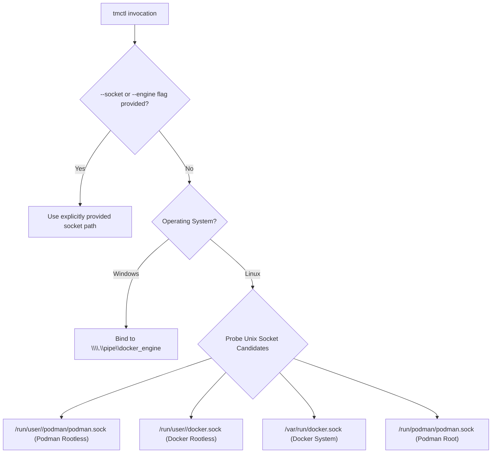

# 📦 Installation & Deployment Guide — `tmctl`

[](https://go.dev)
[](README.md)
[](LICENSE)
[](CONFIG)

This guide provides comprehensive instructions for building, installing, configuring, and verifying the **`tmctl`** (*Unified Cross-Platform Operator CLI*) across Linux workstations, CI/CD runners, and Windows Server hosts.

---

## 📑 Table of Contents

- [1. System & Container Engine Prerequisites](#1-system--container-engine-prerequisites)
- [2. Quick Start Compilation (Native Binary)](#2-quick-start-compilation-native-binary)
- [3. Local PATH Installation (`~/.local/bin`)](#3-local-path-installation-localbin)
- [4. Multi-OS Cross-Compilation Matrix](#4-multi-os-cross-compilation-matrix)
- [5. Container Engine Socket Discovery & Configuration](#5-container-engine-socket-discovery--configuration)
- [6. Two-Tier Storage Workspace Setup](#6-two-tier-storage-workspace-setup)
- [7. Post-Installation Verification & Health Checks](#7-post-installation-verification--health-checks)

---

## 1. System & Container Engine Prerequisites

### Supported Operating Systems
* **Linux:**
  * ✅ **Ubuntu Linux (20.04 / 22.04 / 24.04 LTS), Debian (11 / 12), elementary OS:** 100% Tested & Verified.
  * ✅ **Amazon Linux 2023 (AL2023), RHEL / Rocky Linux (8 / 9):** 100% Tested & Verified.
  * ✅ **Linux ARM64 / AWS Graviton:** 100% Compiled & Verified.
* **Windows:**
  * ✅ **Windows Server 2019 / 2022 / 2025 Datacenter:** 100% Tested & Verified via Docker Named Pipe (`\\.\pipe\docker_engine`).
  * 🔹 **Windows 10 / 11 Desktop (PowerShell):** Supported via Docker Desktop or Podman Machine.

### Container Runtimes Supported
* **Podman:** Version 4.0+ (Rootless mode recommended on Linux).
* **Docker Engine / Mirantis Container Runtime:** Version 24.0+ (Linux and Windows Server).

### Build Tools Required (Build from Source Only)
* **Go Compiler:** Version 1.23+ with `CGO_ENABLED=0` capability.
* **GNU Make & Coreutils:** For automated Makefile targets.

---

## 2. Quick Start Compilation (Native Binary)

To build the static binary for the current host architecture:

```bash
# 1. Clone repository
git clone git@github.com:edkas07-oss/tmctl.git
cd tmctl

# 2. Build native static binary
make build
```

The compiled binary will be placed at `bin/tmctl` (Linux) or `bin/tmctl.exe` (Windows).

> [!NOTE]
> `tmctl` is compiled with `CGO_ENABLED=0` and stripped symbols (`-s -w`), producing a single, self-contained static binary with zero external runtime dependencies.

---

## 3. Local PATH Installation (`~/.local/bin`)

To install `tmctl` directly into your user's executable path:

```bash
# Install to ~/.local/bin/tmctl
make install

# Verify PATH resolution
export PATH="${HOME}/.local/bin:${PATH}"
tmctl version
```

On Windows Server (PowerShell):
```powershell
# Copy binary to system path or home workspace
New-Item -ItemType Directory -Force -Path C:\tm-home\bin
Copy-Item .\bin\windows_amd64\tmctl.exe C:\tm-home\bin\tmctl.exe
[Environment]::SetEnvironmentVariable("Path", $env:Path + ";C:\tm-home\bin", "User")
```

---

## 4. Multi-OS Cross-Compilation Matrix

To generate release-grade static binaries for all supported enterprise architectures simultaneously:

```bash
make build-all
```

### Generated Artifact Matrix:

| Output Binary | Target Architecture | Format | Size | Target Environment |
| :--- | :--- | :--- | :---: | :--- |
| `bin/linux_amd64/tmctl` | `linux/amd64` | ELF 64-bit Static | ~5.7 MB | Linux Server (x86_64), CI Runners |
| `bin/linux_arm64/tmctl` | `linux/arm64` | ELF 64-bit Static | ~5.5 MB | AWS Graviton, ARM64 Edge Nodes |
| `bin/windows_amd64/tmctl.exe` | `windows/amd64` | PE32+ Executable | ~5.9 MB | Windows Server 2019/2022/2025 |
| `bin/checksums.txt` | All | SHA-256 Manifest | - | Cryptographic Integrity Checksums |

---

## 5. Container Engine Socket Discovery & Configuration

`tmctl` automatically discovers the active container engine socket in the following priority:



### Configuration Overrides (`CONFIG` / Environment Variables):

| Variable | Environment Variable | Default | Description |
| :--- | :--- | :--- | :--- |
| `CONTAINER_ENGINE` | `CONTAINER_ENGINE` | *(Auto-detected)* | Override engine (`podman` or `docker`) |
| `SOCKET_PATH` | `SOCKET_PATH` | *(Auto-detected)* | Custom Unix domain socket or named pipe |
| `PLATFORM_NAME` | `PLATFORM_NAME` | `tomcat-monitoring` | Target platform metadata identifier |
| `NETWORK_NAME` | `NETWORK_NAME` | `devops-lab` | Target OCI bridge network |
| `DIAGNOSTIC_URL` | `DIAGNOSTIC_URL` | `https://localhost:8443` | Diagnostic Service API endpoint |

---

## 6. Two-Tier Storage Workspace Setup

`tmctl` orchestrates workloads using a standardized Two-Tier storage model:

```text
Host Workspace (Tier 2):
├── Linux:   /opt/tm-home/ (or ~/.local/share/tm-home)
└── Windows: C:\tm-home\

Engine Named Volumes (Tier 1):
├── prometheus_data       (TSDB time-series storage)
├── diagnostic_data       (SQLite database diagnostic.db)
└── tomcat_logs           (Shared catalina.out logs)
```

Ensure the host workspace directory exists with appropriate permissions:
```bash
# Linux (Rootless mode permissions)
mkdir -p /opt/tm-home/{spool,secrets,tls,config}
chmod 700 /opt/tm-home/spool /opt/tm-home/secrets

# Windows Server (PowerShell)
New-Item -ItemType Directory -Force -Path C:\tm-home\spool, C:\tm-home\secrets, C:\tm-home\tls, C:\tm-home\config
```

---

## 7. Post-Installation Verification & Health Checks

Verify your installation and socket connectivity:

```bash
# 1. Check binary build metadata and detected socket
tmctl version

# 2. Inspect container stack state
tmctl stack status

# 3. Validate repository layout and platform governance rules
tmctl validate
```
