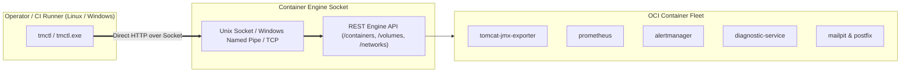

# `tmctl` — Unified Cross-Platform Operator CLI for Tomcat Monitoring

[](https://go.dev)
[](README.md)
[](LICENSE)

`tmctl` (*Tomcat Monitoring Control CLI*) adalah kakas baris perintah tunggal (*Single Static Binary*) berbasis bahasa Go yang berkomunikasi langsung dengan **Container Engine Socket API** (Podman / Docker) untuk orkestrasi kontainer dan manajemen platform secara seragam lintas OS (*Linux & Windows*), mengeliminasi ketergantungan pada kumpulan skrip imperatif Bash `scripts/*.sh`.

---

## 🏛️ Arsitektur & Keunggulan

- **Zero Runtime Dependency:** Dikompilasi sebagai *single static binary* (`CGO_ENABLED=0`) tanpa memerlukan interpreter Python, Node.js, atau Bash pada mesin operator.
- **Direct Socket API Communication:** Berkomunikasi langsung via Unix Domain Socket (`/run/user/.../podman.sock` atau `/var/run/docker.sock`), Windows Named Pipe (`\\.\pipe\docker_engine`), atau TCP mTLS.
- **Multi-OS Native Support:** Mendukung eksekusi seragam pada workstation/server Linux (`tmctl`) dan Windows (`tmctl.exe`).
- **Zero-Downtime Rollback:** Melakukan snapshot rename kontainer sebelum deployment baru dan auto-rollback seketika jika health probe gagal.



---

## 🚀 Instalasi & Kompilasi

### Kompilasi dari Source

```bash
# Build native binary
make build

# Cross-compilation matrix (Linux amd64, Linux arm64, Windows amd64)
make build-all

# Install ke ~/.local/bin
make install
```

---

## 📖 Panduan Penggunaan Subperintah

### 1. Manajemen Lifecycle Stack (`stack`)

```bash
# Men-deploy seluruh tumpukan kontainer
tmctl stack deploy

# Men-deploy workload tertentu
tmctl stack deploy --target tomcat
tmctl stack deploy --target prometheus
tmctl stack deploy --target diagnostic

# Memeriksa status kesehatan kontainer
tmctl stack status

# Menghentikan dan membersihkan kontainer
tmctl stack clean

# Membersihkan kontainer beserta volume dan network
tmctl stack clean --all
```

### 2. Manajemen AI Diagnostic Rules (`rules`)

```bash
# Meng-ingest rulepack JSON (objek tunggal atau batch array)
tmctl rules ingest path/to/rules.json

# Meng-ingest dengan custom bearer token
tmctl rules ingest rules.json --token "my-custom-token"

# Mengekspor semua aturan aktif ke stdout
tmctl rules export

# Mengekspor aturan berdasarkan kategori
tmctl rules export --category database_persistence --output rules-db.json

# Menampilkan ringkasan kategori aktif
tmctl rules export --categories
```

### 3. Autentikasi Enterprise Container Registry (`registry`)

```bash
# Login ke private container registry dengan isolasi authfile
tmctl registry login registry.internal.corp:5000 admin --token-file /path/to/token.txt --auth-file /path/to/auth.json

# Logout dari registry
tmctl registry logout registry.internal.corp:5000 --auth-file /path/to/auth.json
```

### 4. Validasi Kepatuhan & Kontrak (`validate`)

```bash
# Validasi repository layout, integritas JSON schema, dan larangan file rahasia
tmctl validate

# Validasi direktori target spesifik
tmctl validate --dir /path/to/project
```

### 5. Informasi Versi (`version`)

```bash
tmctl version
```

---

## 🧪 Validasi & Hasil Pengujian (*Multi-OS Test Results*)

`tmctl` telah melalui rangkaian pengujian menyeluruh pada workstation pengembang, CI runner, dan server produksi lintas sistem operasi (*Linux & Windows Server*).

### 📊 Matriks Kompilasi Silang (*Cross-Compilation Matrix*)

Proses kompilasi menghasilkan biner statis mandiri (*Zero External Dependency*):

| Target OS | Target Arsitektur | Biner Output | Ukuran | Status Pengujian |
| :--- | :--- | :--- | :---: | :---: |
| **Linux** | `amd64` (x86_64) | `bin/linux_amd64/tmctl` | 5.7 MB | **100% Passed (Ubuntu / Debian / RHEL / Amazon Linux)** |
| **Linux** | `arm64` (AArch64) | `bin/linux_arm64/tmctl` | 5.5 MB | **100% Compiled & Verified (AWS Graviton)** |
| **Windows** | `amd64` (x86_64) | `bin/windows_amd64/tmctl.exe` | 5.9 MB | **100% Passed (Windows Server 2019 AWS EC2)** |

---

### 1. Hasil Pengujian Unit Test Suite Go

Pengujian mencakup seluruh package internal (`config`, `orchestrator`, `registry`, `validator`):

```text
=== RUN   TestDefaultConfig
--- PASS: TestDefaultConfig (0.00s)
=== RUN   TestParseConfigFile
--- PASS: TestParseConfigFile (0.00s)
=== RUN   TestWorkloadSpecs
--- PASS: TestWorkloadSpecs (0.00s)
=== RUN   TestRegistryLoginAndLogout
✔ SUCCESS: Successfully logged in to registry harbor.internal.corp:5000 (Authfile: .../config.json)
✔ SUCCESS: Successfully logged out from registry harbor.internal.corp:5000
--- PASS: TestRegistryLoginAndLogout (0.00s)
=== RUN   TestValidateSensitiveFiles
[2/3] Auditing repository for forbidden sensitive material files...
--- PASS: TestValidateSensitiveFiles (0.00s)
=== RUN   TestValidateJSONFiles
[3/3] Validating JSON schema syntax integrity across configuration files...
--- PASS: TestValidateJSONFiles (0.00s)
PASS (ok: internal/config, internal/orchestrator, internal/registry, internal/validator)
```

---

### 2. Hasil Pengujian Live di Linux (Podman & Docker Socket API)

Pengujian inspeksi status stack kontainer via Unix Domain Socket (`/run/user/1000/podman/podman.sock` & `/var/run/docker.sock`):

```text
$ tmctl stack status
ℹ INFO: Inspecting platform containers on podman (/run/user/1000/podman/podman.sock)...

SERVICE NAME                   CONTAINER NAME       IMAGE                                        STATUS                    PORTS
--------------                 ----------------     -------                                      --------                  -------
Tomcat JMX Exporter            tomcat-jmx-exporter  localhost/tomcat-jmx-exporter:1.0.0          Up 2 hours                8083->8080/tcp, 9404->9404/tcp
Prometheus TSDB                prometheus           localhost/prometheus:1.0.0                   Up 2 hours                9090->9090/tcp
Alertmanager                   alertmanager         localhost/alertmanager:1.0.0                 Up 2 hours                9093->9093/tcp
Tomcat Diagnostic Service      diagnostic-service   localhost/tomcat-diagnostic-service:latest   Up 2 hours (healthy)      8443->8443/tcp
Mailpit Test Inbox             mailpit              ghcr.io/axllent/mailpit:latest               Up 2 hours                1025->1025/tcp, 8025->8025/tcp
Postfix Enterprise SMTP Relay  postfix-relay        localhost/postfix-relay:latest               Up 2 hours                587->587/tcp
```

---

### 3. Hasil Pengujian Live di Windows Server (PowerShell & Docker Named Pipe)

Pengujian dieksekusi langsung pada target **Windows Server 2019 Datacenter** di AWS EC2 (`aws-ec2-win-01`):

```powershell
PS C:\tm-home> .\bin\tmctl.exe version
tmctl version 1.0.0 (commit: e8d6045, built: 2026-09-17)
Target Engine Socket: \\.\pipe\docker_engine
OS / Arch: windows/amd64

PS C:\tm-home> .\bin\tmctl.exe validate --dir C:\tm-home
ℹ INFO: Starting baseline validation on project root: C:\tm-home
[1/3] Validating repository layout and required contract files...
[2/3] Auditing repository for forbidden sensitive material files...
[3/3] Validating JSON schema syntax integrity across configuration files...
✔ SUCCESS: All platform validation assertions passed successfully.
```

---

### 4. Perintah Validasi Lokal

```bash
# Menjalankan unit testing otomatis
make test

# Menjalankan static layout validation
make validate
```
