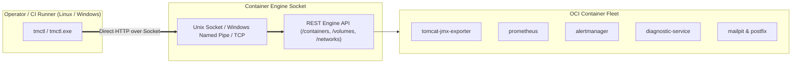

# `tmctl` — Unified Cross-Platform Operator CLI for Tomcat Monitoring

[](https://go.dev)
[](README.md)
[](LICENSE)

`tmctl` (*Tomcat Monitoring Control CLI*) adalah kakas baris perintah tunggal (*Single Static Binary*) berbasis bahasa Go yang berkomunikasi langsung dengan **Container Engine Socket API** (Podman / Docker) untuk orkestrasi kontainer dan manajemen platform secara seragam lintas OS (*Linux & Windows*), mengeliminasi ketergantungan pada kumpulan skrip imperatif Bash `scripts/*.sh`.

---

## 🏛️ Arsitektur & Keunggulan

- **Zero Runtime Dependency:** Dikompilasi sebagai *single static binary* (`CGO_ENABLED=0`) tanpa memerlukan interpreter Python, Node.js, atau Bash pada mesin operator.
- **Direct Socket API Communication:** Berkomunikasi langsung via Unix Domain Socket (`/run/user/.../podman.sock` atau `/var/run/docker.sock`), Windows Named Pipe (`\\.\pipe\docker_engine`), atau TCP mTLS.
- **Multi-OS Native Support:** Mendukung eksekusi seragam pada workstation/server Linux (`tmctl`) dan Windows (`tmctl.exe`).
- **Zero-Downtime Rollback:** Melakukan snapshot rename kontainer sebelum deployment baru dan auto-rollback seketika jika health probe gagal.



---

## 🚀 Instalasi & Kompilasi

### Kompilasi dari Source

```bash
# Build native binary
make build

# Cross-compilation matrix (Linux amd64, Linux arm64, Windows amd64)
make build-all

# Install ke ~/.local/bin
make install
```

---

## 📖 Panduan Penggunaan Subperintah

### 1. Manajemen Lifecycle Stack (`stack`)

```bash
# Men-deploy seluruh tumpukan kontainer
tmctl stack deploy

# Men-deploy workload tertentu
tmctl stack deploy --target tomcat
tmctl stack deploy --target prometheus
tmctl stack deploy --target diagnostic

# Memeriksa status kesehatan kontainer
tmctl stack status

# Menghentikan dan membersihkan kontainer
tmctl stack clean

# Membersihkan kontainer beserta volume dan network
tmctl stack clean --all
```

### 2. Manajemen AI Diagnostic Rules (`rules`)

```bash
# Meng-ingest rulepack JSON (objek tunggal atau batch array)
tmctl rules ingest path/to/rules.json

# Meng-ingest dengan custom bearer token
tmctl rules ingest rules.json --token "my-custom-token"

# Mengekspor semua aturan aktif ke stdout
tmctl rules export

# Mengekspor aturan berdasarkan kategori
tmctl rules export --category database_persistence --output rules-db.json

# Menampilkan ringkasan kategori aktif
tmctl rules export --categories
```

### 3. Autentikasi Enterprise Container Registry (`registry`)

```bash
# Login ke private container registry dengan isolasi authfile
tmctl registry login registry.internal.corp:5000 admin --token-file /path/to/token.txt --auth-file /path/to/auth.json

# Logout dari registry
tmctl registry logout registry.internal.corp:5000 --auth-file /path/to/auth.json
```

### 4. Validasi Kepatuhan & Kontrak (`validate`)

```bash
# Validasi repository layout, integritas JSON schema, dan larangan file rahasia
tmctl validate

# Validasi direktori target spesifik
tmctl validate --dir /path/to/project
```

### 5. Informasi Versi (`version`)

```bash
tmctl version
```

---

## 🧪 Validasi & Pengujian

```bash
# Menjalankan unit tests
make test

# Menjalankan static layout validation
make validate
```
