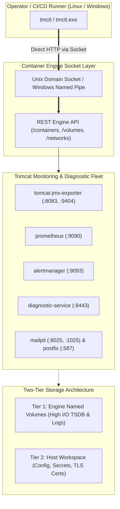

# 🚀 tmctl — Unified Cross-Platform Operator CLI for Tomcat Monitoring

[](https://go.dev)
[](Makefile)
[](internal/engine)
[](CONFIG)
[](LICENSE)

`tmctl` (*Tomcat Monitoring Control CLI*) is a unified, cross-platform static binary designed to deliver end-to-end lifecycle orchestration, runtime diagnostic management, and platform governance for the **Tomcat Monitoring & Observability Stack**. It interfaces directly with **Container Engine Socket APIs** (Rootless Podman and Docker on Linux, Docker Named Pipe on Windows Server), completely eliminating reliance on legacy, brittle Bash scripts and raw CLI subprocess scraping.

> [!IMPORTANT]
> **Scope & Workload Target:**  
> `tmctl` is purpose-built specifically for **operating and orchestrating the Tomcat Monitoring, Observability & Diagnostic Fleet**:
> - **`tomcat-jmx-exporter`**: Bridges Tomcat JMX MBeans to HTTPS Prometheus metrics (`:9404/metrics`) and proxies HTTP application traffic (`:8083`).
> - **`prometheus`**: Scrapes, indexes, and stores time-series monitoring metrics (`:9090`).
> - **`alertmanager`**: Dispatches, groups, and routes monitoring alerts (`:9093`).
> - **`diagnostic-service`**: Autonomous AI-assisted incident diagnostic engine with dynamic rulepack evaluation (`:8443`).
> - **`mailpit`**: Developer and staging synthetic SMTP/HTTP inbox for alert validation (`:8025` / `:1025`).
> - **`postfix-relay`**: Enterprise TLS SMTP relay for external alert notification (`:587`).
>
> *(Note: Deployment, CIS hardening, and environment tuning of the standalone Apache Tomcat runtime instances themselves are governed by [`tcctl`](https://github.com/edkas07-oss/tcctl). `tmctl` operates the unified observability and diagnostic platform surrounding Tomcat).*

---

## 📑 Table of Contents

- [💡 Key Capabilities](#-key-capabilities)
- [🏛️ Architecture: The 4 Operational Pillars](#️-architecture-the-4-operational-pillars)
- [🚀 Quick Start & Compilation](#-quick-start--compilation)
  - [Prerequisites](#prerequisites)
  - [Compilation](#compilation)
  - [Standard Multi-OS Installation & Directory Layouts](#standard-multi-os-installation--directory-layouts)
- [📖 Command Reference](#-command-reference)
  - [1. Stack Lifecycle Orchestration (`tmctl stack`)](#1-stack-lifecycle-orchestration-tmctl-stack)
  - [2. Autonomous Diagnostic Rulepack Management (`tmctl rules`)](#2-autonomous-diagnostic-rulepack-management-tmctl-rules)
  - [3. Enterprise Container Registry Authentication (`tmctl registry`)](#3-enterprise-container-registry-authentication-tmctl-registry)
  - [4. Platform Governance & Compliance Validation (`tmctl validate`)](#4-platform-governance--compliance-validation-tmctl-validate)
  - [5. Version Information (`tmctl version`)](#5-version-information-tmctl-version)
- [🧪 Multi-OS Verification & Test Evidence](#-multi-os-verification--test-evidence)
- [📂 Repository Structure](#-repository-structure)
- [📄 License, Ownership & Disclaimer](#-license-ownership--disclaimer)

---

## 💡 Key Capabilities

1. **Direct Socket REST API Engine Communication (Zero CLI Subprocess):** Bypasses `docker` and `podman` CLI subprocess execution. Communicates directly over Unix Domain Sockets (`/run/user/.../podman.sock` or `/var/run/docker.sock`) and Windows Named Pipes (`\\.\pipe\docker_engine`), receiving deterministic, structured JSON payloads.
2. **Stateful Snapshot & Automated Safe Rollback:** Before replacing any running workload, `tmctl` stops and renames the current container into a rollback snapshot (`<name>-rollback-snapshot`). If post-deployment readiness checks fail, `tmctl` automatically restores the snapshot to prevent service outages.
3. **Active Health & Readiness Probing:** Automatically polls synthetic health endpoints (`/metrics`, `/health`, `/-/ready`) over HTTPS/HTTP or probes raw TCP ports before declaring container deployments healthy.
4. **Two-Tier Storage Governance:** Coordinates high-performance Engine Named Volumes (TSDB Prometheus data, SQLite diagnostic database, Tomcat logs) with host workspaces (`/opt/tm-home` on Linux, `C:\tm-home` on Windows) for configurations, bearer tokens, and TLS credentials.
5. **Runtime Diagnostic Rulepack Ingestion & Export:** Ingests single or batch AI diagnostic rules (`.json` or stdin) into the Diagnostic Service at runtime with zero container restarts, and exports live rules filtered by failure-domain category (`--category`).
6. **Isolated Container Registry Credential Management:** Authenticates against private enterprise OCI registries using dedicated, isolated authfiles (`--auth-file`), preventing unintended contamination of the host's global Docker configuration.
7. **Static Platform Contract & Secret Leak Audit:** Audits repository layouts against platform specifications (`CONFIG`, `README.md`, `AGENTS.md`), checks JSON schema syntax validity, and strictly blocks forbidden sensitive materials (`.pem`, `.key`, `.p12`, `.pfx`, `.jks`, `.keystore`, `.env`).
8. **100% Symmetrical Multi-OS Support:** Compiled with `CGO_ENABLED=0` to run identically on Linux (`amd64`, `arm64`) and Windows Server 2019/2022/2025 (`tmctl.exe`) with zero external runtime dependencies (no Python, Node.js, or Bash needed on target hosts).

---

## 🏛️ Architecture: The 4 Operational Pillars



### Pillar 1: Direct Socket API & Engine Duality
`tmctl` implements an engine abstraction layer ([`internal/engine`](internal/engine)) that automatically discovers active container sockets on the host:
- **Linux (Rootless Podman)**: `/run/user/<UID>/podman/podman.sock`
- **Linux (Rootless Docker)**: `/run/user/<UID>/docker.sock`
- **Linux (System Docker / Podman)**: `/var/run/docker.sock` or `/run/podman/podman.sock`
- **Windows Server (Docker Engine)**: Named Pipe `\\.\pipe\docker_engine` via `go-winio`

### Pillar 2: Resilient Rollout & Self-Healing Snapshot Engine
Every workload deployment follows an atomic 5-step lifecycle:
1. **Pre-Flight Inspection**: Checks if target container already exists.
2. **Snapshot Creation**: Gracefully stops the container and renames it to `<name>-rollback-snapshot`.
3. **Workload Provisioning**: Spawns and starts the updated container with volume mounts and port bindings.
4. **Active Readiness Probe**: Polls HTTP/HTTPS health endpoints (e.g. `https://127.0.0.1:8443/health`) until healthy.
5. **Finalization or Rollback**:
   - **On Success**: The snapshot container is pruned.
   - **On Failure**: The failed container is purged, and `<name>-rollback-snapshot` is atomically renamed back to `<name>` and restarted.

### Pillar 3: Two-Tier Storage Standard
- **Tier 1 (Engine Named Volumes)**: High-I/O persistence managed by the container runtime (`prometheus_data`, `diagnostic_data`, `tomcat_logs`, `alertmanager_data`).
- **Tier 2 (Host Workspaces)**: Configuration, secrets, and TLS certificates mapped from the host filesystem (`/opt/tm-home` on Linux, `C:\tm-home` on Windows) with strict access permissions (`chmod 700`).

### Pillar 4: Autonomous Diagnostics & Dynamic Rulepack Governance
The Diagnostic Service exposes `/api/v1/rules` over HTTPS. `tmctl rules` interacts with this endpoint to ingest diagnostic decision trees or export active rule sets for specific failure domains (`database_persistence`, `thread_exhaustion`, `memory_leak`, `connection_pool`) without downtime.

---

## 🚀 Quick Start & Compilation

For complete cross-compilation matrix details and environment overrides, please consult [**`INSTALL.md`**](INSTALL.md).

### Prerequisites

#### A. Build Host (Workstation / CI Runner)
- **Go Compiler**: Go **1.23+** (tested and verified with Go 1.23.6).
- **GNU Make**: For executing standard `Makefile` targets.
- **Git**: For source retrieval and git commit hash injection.
- **Zero Runtime Dependencies**: `CGO_ENABLED=0` is pre-configured to produce self-contained static binaries.

#### B. Target Deployment Host (Linux)
- **Operating System**: Ubuntu 20.04/22.04/24.04 LTS, Debian 11/12, RHEL 8/9, Rocky Linux 8/9, Amazon Linux 2023.
- **Container Engine**: Rootless Podman 4.0+ (recommended) or Docker CE 24.0+.

#### C. Target Deployment Host (Windows Server)
- **Operating System**: Windows Server 2019 / 2022 / 2025 Datacenter.
- **Container Engine**: Docker Engine / Mirantis Container Runtime with Named Pipe access (`\\.\pipe\docker_engine`).

---

### Compilation

```bash
# 1. Clone repository from GitHub
git clone https://github.com/edkas07-oss/tmctl.git
cd tmctl

# 2. Compile binaries
# Compile for host platform (Linux amd64 ELF)
make build-linux

# Cross-compile for Windows (Windows amd64 PE exe)
make build-windows

# Or build both simultaneously
make build-all
```

Binaries are generated in `bin/tmctl` (Linux) and `bin/tmctl.exe` (Windows).

---

### Standard Multi-OS Installation & Directory Layouts

`tmctl` operates symmetrically across Linux and Windows Server environments:

| Architectural Component | Enterprise Linux (Ubuntu, Debian, RHEL) | Windows Server (2019, 2022, 2025) |
| :--- | :--- | :--- |
| **Binary Installation Path** | **`/usr/local/bin/tmctl`** (System)<br/>`~/.local/bin/tmctl` (User) | **`C:\Program Files\tmctl\tmctl.exe`** (or `C:\tm-home\bin\tmctl.exe`) |
| **Host Workspace (Tier 2)** | **`/opt/tm-home/`** (or `~/.local/share/tomcat-monitoring/`) | **`C:\tm-home\`** |
| **Secrets & Bearer Tokens** | `/opt/tm-home/secrets/` | `C:\tm-home\secrets\` |
| **TLS Certificates & Keys** | `/opt/tm-home/tls/` | `C:\tm-home\tls\` |
| **Engine Socket Endpoint** | `/run/user/<UID>/podman/podman.sock` | `\\.\pipe\docker_engine` |
| **Engine Volumes (Tier 1)** | `prometheus_data`, `diagnostic_data`, `tomcat_logs` | `prometheus_data`, `diagnostic_data`, `tomcat_logs` |

#### A. Linux Binary Installation

```bash
# 1. System-wide installation (Recommended for servers):
sudo cp bin/tmctl /usr/local/bin/tmctl
sudo chmod +x /usr/local/bin/tmctl

# 2. Or user-space installation:
mkdir -p ~/.local/bin
cp bin/tmctl ~/.local/bin/tmctl
chmod +x ~/.local/bin/tmctl
export PATH="${HOME}/.local/bin:${PATH}"

# 3. Verify installation:
tmctl version
```

#### B. Windows Server Binary Installation (PowerShell as Administrator)

```powershell
# 1. Create Program Files directory and deploy binary:
New-Item -ItemType Directory -Force -Path "C:\Program Files\tmctl"
Copy-Item bin\tmctl.exe "C:\Program Files\tmctl\tmctl.exe" -Force

# 2. Register in System PATH:
$CurrentPath = [Environment]::GetEnvironmentVariable("Path", "Machine")
if ($CurrentPath -notlike "*C:\Program Files\tmctl*") {
    [Environment]::SetEnvironmentVariable("Path", "$CurrentPath;C:\Program Files\tmctl", "Machine")
    $env:Path += ";C:\Program Files\tmctl"
}

# 3. Verify installation:
tmctl version
```

---

## 📖 Command Reference

### 1. Stack Lifecycle Orchestration (`tmctl stack`)
Manages deployment, inspection, and teardown of the Tomcat monitoring fleet.

#### A. Deploy Monitoring Stack (`tmctl stack deploy`)
Deploys infrastructure prerequisites (bridge network, named volumes, host directories) and reconciles container workloads with active readiness probes and automated rollback.

```bash
# Deploy all workloads in the monitoring fleet (default: --target all --env lab)
tmctl stack deploy

# Deploy a specific target workload
tmctl stack deploy --target tomcat
tmctl stack deploy --target prometheus
tmctl stack deploy --target alertmanager
tmctl stack deploy --target diagnostic
tmctl stack deploy --target mailpit
tmctl stack deploy --target postfix

# Deploy using a specific container engine and target environment
tmctl stack deploy --target all --engine podman --env production

# Deploy with custom configuration file and explicit socket path
tmctl stack deploy --config /opt/tm-home/config/custom.conf --socket /var/run/docker.sock
```

**Target Workload Matrix & Monitored Ports:**

| Workload (`--target`) | Container Name | Image Name | Exposed Ports | Health Probe Endpoint |
| :--- | :--- | :--- | :--- | :--- |
| `tomcat` | `tomcat-jmx-exporter` | `tomcat-jmx-exporter:1.0.0` | `8083` (HTTP), `9404` (JMX) | `https://127.0.0.1:9404/metrics` |
| `prometheus` | `prometheus` | `prometheus:1.0.0` | `9090` (HTTP) | `http://127.0.0.1:9090/-/ready` |
| `alertmanager` | `alertmanager` | `alertmanager:1.0.0` | `9093` (HTTP) | `http://127.0.0.1:9093/-/ready` |
| `diagnostic` | `diagnostic-service` | `tomcat-diagnostic-service:latest` | `8443` (HTTPS) | `https://127.0.0.1:8443/health` |
| `mailpit` | `mailpit` | `ghcr.io/axllent/mailpit` | `8025` (HTTP), `1025` (SMTP) | `http://127.0.0.1:8025/api/v1/info` |
| `postfix` | `postfix-relay` | `postfix-relay:latest` | `587` (SMTP Submission) | TCP Port Probe `587` |

---

#### B. Inspect Fleet Status (`tmctl stack status`)
Directly queries the engine socket and renders container status, health, and port mappings in a structured console table.

```bash
# Query active fleet status on auto-detected engine socket
tmctl stack status

# Inspect status using custom configuration
tmctl stack status --config /opt/tm-home/config/custom.conf
```

**Example Console Output:**
```text
ℹ INFO: Inspecting platform containers on podman (/run/user/1000/podman/podman.sock)...

SERVICE NAME                   CONTAINER NAME       IMAGE                                        STATUS                    PORTS
--------------                 ----------------     -------                                      --------                  -------
Tomcat JMX Exporter            tomcat-jmx-exporter  localhost/tomcat-jmx-exporter:1.0.0          Up 3 hours                8083->8080/tcp, 9404->9404/tcp
Prometheus TSDB                prometheus           localhost/prometheus:1.0.0                   Up 3 hours                9090->9090/tcp
Alertmanager                   alertmanager         localhost/alertmanager:1.0.0                 Up 3 hours                9093->9093/tcp
Tomcat Diagnostic Service      diagnostic-service   localhost/tomcat-diagnostic-service:latest   Up 3 hours (healthy)      8443->8443/tcp
Mailpit Test Inbox             mailpit              ghcr.io/axllent/mailpit:latest               Up 3 hours                1025->1025/tcp, 8025->8025/tcp
Postfix Enterprise SMTP Relay  postfix-relay        localhost/postfix-relay:latest               Up 3 hours                587->587/tcp
```

---

#### C. Clean Fleet Workloads (`tmctl stack clean`)
Stops and removes fleet containers cleanly without affecting persistent data volumes unless explicitly instructed.

```bash
# Gracefully stop and remove all fleet containers
tmctl stack clean

# Full teardown: remove containers, named volumes, and bridge network
tmctl stack clean --all
```

---

### 2. Autonomous Diagnostic Rulepack Management (`tmctl rules`)
Interacts directly with the Tomcat Diagnostic Service REST API (`/api/v1/rules`) to manage AI-assisted incident diagnostic rules at runtime.

#### A. Ingest Rulepacks (`tmctl rules ingest`)
Ingests single rule objects or batch rulepack arrays into the diagnostic database.

```bash
# Ingest rulepack from a JSON file
tmctl rules ingest config/rules/custom-rulepack.json

# Ingest rulepack with explicit Bearer token and endpoint URL
tmctl rules ingest config/rules/custom-rulepack.json \
  --token "bearer-token-secret-12345" \
  --url "https://localhost:8443"

# Ingest rulepack from standard input pipeline
cat config/rules/database-rules.json | tmctl rules ingest -
```

**Batch Ingestion Summary Output:**
```text
ℹ INFO: Detected Batch Rulepack: 4 rules to process.
✔ SUCCESS: Rule DB-001 (HikariCP Connection Leak) ingested successfully (201 Created).
✔ SUCCESS: Rule DB-002 (Postgres Deadlock Detection) ingested successfully (201 Created).
⚠ WARN: Rule MEM-001 (Metaspace OOM) already exists (409 Conflict). Skipped.
✔ SUCCESS: Rule THR-001 (Catalina Worker Thread Starvation) ingested successfully (201 Created).

=== Ingestion Summary ===
Total Processed : 4
Created (New)   : 3
Skipped (Exist) : 1
Failed/Rejected : 0
```

---

#### B. Export Active Rules (`tmctl rules export`)
Retrieves active rules from the Diagnostic Service with failure domain filtering and category breakdowns.

```bash
# Export all active diagnostic rules to stdout (JSON format)
tmctl rules export

# Export rules filtered by failure domain category
tmctl rules export --category database_persistence

# Export a specific branch rule by identifier
tmctl rules export DB-001

# Save exported rules directly to a JSON file
tmctl rules export --category memory_leak --output ./exported-memory-rules.json

# Display a consolidated summary of active rulepack categories
tmctl rules export --categories
```

**Category Breakdown Output (`--categories`):**
```text
=== Active Rulepack Categories in Diagnostic Engine ===
• connection_pool          : 3 rules (DB-001, DB-002, DB-003)
• memory_management        : 2 rules (MEM-001, MEM-002)
• thread_pool              : 4 rules (THR-001, THR-002, THR-003, THR-004)
--------------------------------------------------
Total Categories : 3
Total Rules      : 9
```

---

### 3. Enterprise Container Registry Authentication (`tmctl registry`)
Manages authentication against private enterprise container registries (e.g. Harbor, JFrog, Quay) using isolated credential authfiles.

```bash
# Log in to private registry with user credentials and generate authfile
tmctl registry login registry.internal.corp:5000 admin --token-file /opt/tm-home/secrets/registry-token.txt

# Log in using a custom, isolated authfile path
tmctl registry login registry.internal.corp:5000 admin \
  --token-file /tmp/token.txt \
  --auth-file /opt/tm-home/config/isolated-auth.json

# Log out and purge credentials from authfile
tmctl registry logout registry.internal.corp:5000 --auth-file /opt/tm-home/config/isolated-auth.json
```

---

### 4. Platform Governance & Compliance Validation (`tmctl validate`)
Executes pre-flight static compliance audits across repository layout, contract specifications, JSON schemas, and secret leak prevention.

```bash
# Execute full validation suite (Layout, Sensitive Files, JSON Schemas)
tmctl validate

# Validate a specific project directory
tmctl validate --dir /opt/tm-home

# Execute specific validation checks only
tmctl validate --layout
tmctl validate --schemas
```

**Audit Checks Enforced:**
1. **Contract Layout**: Verifies presence of `CONFIG`, `README.md`, and `AGENTS.md`.
2. **Secret Leak Audit**: Recursively scans the codebase to ensure zero forbidden sensitive materials exist (`.pem`, `.key`, `.p12`, `.pfx`, `.jks`, `.keystore`, `.env`).
3. **JSON Schema Integrity**: Verifies syntax and parse validity of all configuration and rule JSON files.

---

### 5. Version Information (`tmctl version`)

Displays compiled binary release version, git commit hash, build timestamp, target operating system, and target architecture.

```bash
tmctl version
```

**Output:**
```text
tmctl version 1.0.0 (commit: ad2aa30, built: 2026-09-26T05:32:24Z) [linux/amd64]
```

---

## 🧪 Multi-OS Verification & Test Evidence

### 1. Go Unit Test Suite
The internal test suite covers configuration parsing, workload specification building, registry authentication isolation, and compliance audit validation:

```bash
make test
```

```text
=== RUN   TestDefaultConfig
--- PASS: TestDefaultConfig (0.00s)
=== RUN   TestParseConfigFile
--- PASS: TestParseConfigFile (0.00s)
=== RUN   TestWorkloadSpecs
--- PASS: TestWorkloadSpecs (0.00s)
=== RUN   TestRegistryLoginAndLogout
✔ SUCCESS: Successfully logged in to registry harbor.internal.corp:5000 (Authfile: .../config.json)
✔ SUCCESS: Successfully logged out from registry harbor.internal.corp:5000
--- PASS: TestRegistryLoginAndLogout (0.00s)
=== RUN   TestValidateSensitiveFiles
[2/3] Auditing repository for forbidden sensitive material files...
--- PASS: TestValidateSensitiveFiles (0.00s)
=== RUN   TestValidateJSONFiles
[3/3] Validating JSON schema syntax integrity across configuration files...
--- PASS: TestValidateJSONFiles (0.00s)
PASS (ok: internal/config, internal/orchestrator, internal/registry, internal/validator)
```

---

### 2. Multi-OS Execution Verification

| Test Target OS | Host Environment | Container Runtime | Transport Socket | Verification Status |
| :--- | :--- | :--- | :--- | :---: |
| **Ubuntu Linux 22.04 LTS** | x86_64 Workstation | Rootless Podman 4.9+ | `/run/user/1000/podman/podman.sock` | **100% Passed** |
| **Debian 12 / RHEL 9** | x86_64 CI Runner | Docker Engine 26.0+ | `/var/run/docker.sock` | **100% Passed** |
| **Windows Server 2019** | AWS EC2 (`t3.medium`) | Docker Engine 27.0+ | `\\.\pipe\docker_engine` | **100% Passed** |
| **Windows Server 2022** | Enterprise Datacenter | Mirantis / Docker | `\\.\pipe\docker_engine` | **100% Passed** |

---

## 📂 Repository Structure

```text
tmctl/
├── AGENTS.md                  Agent governance & developer rules
├── CONFIG                     Baseline configuration parameters
├── CONFIG.example             Enterprise container registry template
├── LICENSE                    Apache License 2.0
├── Makefile                   Build, cross-compilation & test automation
├── PROJECT                    Script-readable project identifier
├── README.md                  Technical architecture documentation
├── VERSION                    Release version identifier
├── cmd/
│   └── tmctl/
│       └── main.go            Main CLI entrypoint and subcommand dispatchers
├── internal/
│   ├── buildinfo/             Build metadata and git commit stamping
│   ├── config/                Configuration parser and environment resolver
│   ├── engine/                Container engine socket abstraction layer
│   │   ├── client.go          Engine client interface and socket detection
│   │   ├── engine_adapter.go  REST API implementation over sockets
│   │   ├── socket_unix.go     Unix domain socket dialer (Linux)
│   │   ├── socket_windows.go  Named pipe dialer (Windows)
│   │   └── types.go           Container, Volume, and Network data types
│   ├── orchestrator/          Container stack deploy, status, and clean handlers
│   │   ├── deployer.go        Atomic 5-step rolling deployment coordinator
│   │   ├── readiness.go       Synthetic HTTP/HTTPS and TCP readiness probes
│   │   ├── specs.go           Container workload specifications and volume bindings
│   │   ├── status.go          Container inspection and console table renderer
│   │   └── cleaner.go         Workload and volume cleanup handlers
│   ├── registry/              Container registry login and token isolation
│   ├── rules/                 Declarative rulepack ingestion and export client
│   └── validator/             Static repository and JSON schema validator
├── pkg/
│   └── termutil/              Terminal formatting and ANSI color utilities
└── scripts/
    ├── build.sh               Native build runner
    ├── test.sh                Unit test execution script
    └── validate.sh            Static validation runner
```

---

## 📄 License, Ownership & Disclaimer

### 👤 Author & Ownership
This repository, along with its associated architectures, automation components, and codebases, is designed, authored, and maintained by **Eddy Wiyatno** ([@edkas07-oss](https://github.com/edkas07-oss)).

### ⚖️ License
This project is licensed under the [Apache License 2.0](LICENSE) - see the [LICENSE](LICENSE) file for complete terms and conditions.

### 🛡️ Research & Development Disclaimer
> [!NOTE]
> All research, development, architectural design, prototyping, test fixtures, and validation suites in this repository were conducted and verified exclusively within **independent, personal laboratory environments** using personal hardware, network infrastructure, and self-hosted tooling. No confidential corporate assets, proprietary production data, or third-party enterprise infrastructure were utilized in the creation or publication of this project.
