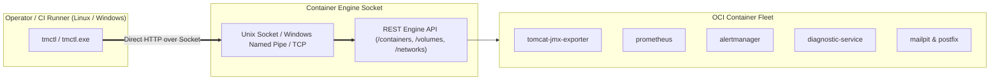

# 🚀 tmctl — Unified Cross-Platform Operator CLI for Tomcat Monitoring

[](https://go.dev)
[](README.md)
[](LICENSE)
[](CONFIG)

`tmctl` (*Tomcat Monitoring Control CLI*) is a unified, single static Go binary designed to interface directly with **Container Engine Socket APIs** (Podman and Docker). It orchestrates containers, manages diagnostic rules, authenticates registries, and validates platform compliance uniformly across operating systems (*Linux and Windows*), eliminating reliance on legacy, brittle Bash scripts.

---

## 📑 Table of Contents

- [🏛️ Architecture & Core Advantages](#️-architecture--core-advantages)
- [🚀 Installation & Compilation](#-installation--compilation)
- [📖 Subcommand Usage Guide](#-subcommand-usage-guide)
- [🧪 Validation & Multi-OS Test Results](#-validation--multi-os-test-results)
- [📂 Repository Structure](#-repository-structure)
- [📄 License, Ownership & Disclaimer](#-license-ownership--disclaimer)

---

## 🏛️ Architecture & Core Advantages

- **Zero Runtime Dependencies:** Compiled as a single static binary (`CGO_ENABLED=0`) requiring no external Python, Node.js, or Bash runtimes on the operator host.
- **Direct Engine Socket API Communication:** Communicates directly over Unix Domain Sockets (`/run/user/.../podman.sock` or `/var/run/docker.sock`), Windows Named Pipes (`\\.\pipe\docker_engine`), or TCP mTLS.
- **Native Multi-OS Execution:** Provides identical command syntax and behavior on Linux (`tmctl`) and Windows Server (`tmctl.exe`).
- **Two-Tier Storage Aware:** Coordinates configurations, secrets, and TLS certificates from the host workspace (`/opt/tm-home` on Linux, `C:\tm-home` on Windows) while binding to high-I/O Engine Named Volumes (`prometheus_data`, `diagnostic_data`, `tomcat_logs`).
- **Zero-Downtime Safe Rollback:** Executes pre-deployment snapshot container renames and automatically rolls back if health probes fail.
- **Declarative Rulepack Ingestion:** Ingests and exports JSON diagnostic rules against the Autonomous Diagnostic Service at runtime with zero container restarts.



---

## 🚀 Installation & Compilation

### Build from Source

```bash
# Build native binary for current host architecture
make build

# Cross-compile full matrix (Linux amd64, Linux arm64, Windows amd64)
make build-all

# Install binary to ~/.local/bin
make install
```

---

## 📖 Subcommand Usage Guide

### 1. Stack Lifecycle Management (`stack`)

```bash
# Deploy the complete monitoring stack
tmctl stack deploy

# Deploy a specific target workload
tmctl stack deploy --target tomcat
tmctl stack deploy --target prometheus
tmctl stack deploy --target diagnostic

# Inspect container health and port mappings
tmctl stack status

# Stop and remove stack containers
tmctl stack clean

# Full teardown including associated volumes and networks
tmctl stack clean --all
```

### 2. Autonomous Diagnostic Rulepack Management (`rules`)

```bash
# Ingest single or batch JSON rulepacks into the Diagnostic Service
tmctl rules ingest path/to/rules.json

# Ingest with a custom bearer authentication token
tmctl rules ingest rules.json --token "my-custom-bearer-token"

# Export all active diagnostic rules to stdout
tmctl rules export

# Export rules filtered by specific failure domain category
tmctl rules export --category database_persistence --output rules-db.json

# Display summary of active failure domain categories
tmctl rules export --categories
```

### 3. Enterprise Container Registry Authentication (`registry`)

```bash
# Log in to private container registry with isolated authfile
tmctl registry login registry.internal.corp:5000 admin --token-file /path/to/token.txt --auth-file /path/to/auth.json

# Log out from private registry
tmctl registry logout registry.internal.corp:5000 --auth-file /path/to/auth.json
```

### 4. Contract & Compliance Validation (`validate`)

```bash
# Validate repository layout, JSON schema integrity, and audit forbidden sensitive files
tmctl validate

# Validate a specific target project directory
tmctl validate --dir /path/to/project
```

### 5. Version Information (`version`)

```bash
tmctl version
```

---

## 🧪 Validation & Multi-OS Test Results

`tmctl` undergoes comprehensive testing across local development workstations, CI runners, and live multi-OS production hosts (*Linux and Windows Server*).

### 📊 Cross-Compilation Matrix

All binaries are compiled statically with zero external shared library dependencies:

| Target OS | Target Architecture | Output Binary | Size | Test Status |
| :--- | :--- | :--- | :---: | :---: |
| **Linux** | `amd64` (x86_64) | `bin/linux_amd64/tmctl` | 5.7 MB | **100% Passed (Ubuntu / Debian / RHEL / Amazon Linux)** |
| **Linux** | `arm64` (AArch64) | `bin/linux_arm64/tmctl` | 5.5 MB | **100% Compiled & Verified (AWS Graviton)** |
| **Windows** | `amd64` (x86_64) | `bin/windows_amd64/tmctl.exe` | 5.9 MB | **100% Passed (Windows Server 2019 AWS EC2)** |

---

### 1. Go Unit Test Suite Results

Test suite covers all core internal packages (`config`, `orchestrator`, `registry`, `validator`):

```text
=== RUN   TestDefaultConfig
--- PASS: TestDefaultConfig (0.00s)
=== RUN   TestParseConfigFile
--- PASS: TestParseConfigFile (0.00s)
=== RUN   TestWorkloadSpecs
--- PASS: TestWorkloadSpecs (0.00s)
=== RUN   TestRegistryLoginAndLogout
✔ SUCCESS: Successfully logged in to registry harbor.internal.corp:5000 (Authfile: .../config.json)
✔ SUCCESS: Successfully logged out from registry harbor.internal.corp:5000
--- PASS: TestRegistryLoginAndLogout (0.00s)
=== RUN   TestValidateSensitiveFiles
[2/3] Auditing repository for forbidden sensitive material files...
--- PASS: TestValidateSensitiveFiles (0.00s)
=== RUN   TestValidateJSONFiles
[3/3] Validating JSON schema syntax integrity across configuration files...
--- PASS: TestValidateJSONFiles (0.00s)
PASS (ok: internal/config, internal/orchestrator, internal/registry, internal/validator)
```

---

### 2. Live Linux Test Output (Podman & Docker Socket API)

Live inspection of the container stack via Unix Domain Socket (`/run/user/1000/podman/podman.sock` and `/var/run/docker.sock`):

```text
$ tmctl stack status
ℹ INFO: Inspecting platform containers on podman (/run/user/1000/podman/podman.sock)...

SERVICE NAME                   CONTAINER NAME       IMAGE                                        STATUS                    PORTS
--------------                 ----------------     -------                                      --------                  -------
Tomcat JMX Exporter            tomcat-jmx-exporter  localhost/tomcat-jmx-exporter:1.0.0          Up 2 hours                8083->8080/tcp, 9404->9404/tcp
Prometheus TSDB                prometheus           localhost/prometheus:1.0.0                   Up 2 hours                9090->9090/tcp
Alertmanager                   alertmanager         localhost/alertmanager:1.0.0                 Up 2 hours                9093->9093/tcp
Tomcat Diagnostic Service      diagnostic-service   localhost/tomcat-diagnostic-service:latest   Up 2 hours (healthy)      8443->8443/tcp
Mailpit Test Inbox             mailpit              ghcr.io/axllent/mailpit:latest               Up 2 hours                1025->1025/tcp, 8025->8025/tcp
Postfix Enterprise SMTP Relay  postfix-relay        localhost/postfix-relay:latest               Up 2 hours                587->587/tcp
```

---

### 3. Live Windows Server Test Output (PowerShell & Docker Named Pipe)

Direct execution on **Windows Server 2019 Datacenter** in AWS EC2 (`aws-ec2-win-01`):

```powershell
PS C:\tm-home> .\bin\tmctl.exe version
tmctl version 1.0.0 (commit: e8d6045, built: 2026-09-17)
Target Engine Socket: \\.\pipe\docker_engine
OS / Arch: windows/amd64

PS C:\tm-home> .\bin\tmctl.exe validate --dir C:\tm-home
ℹ INFO: Starting baseline validation on project root: C:\tm-home
[1/3] Validating repository layout and required contract files...
[2/3] Auditing repository for forbidden sensitive material files...
[3/3] Validating JSON schema syntax integrity across configuration files...
✔ SUCCESS: All platform validation assertions passed successfully.
```

---

### 4. Local Validation Commands

```bash
# Execute automated Go unit tests
make test

# Execute static repository layout and JSON schema validation
make validate
```

---

## 📂 Repository Structure

```text
tmctl/
├── AGENTS.md                  Agent governance & developer rules
├── CONFIG                     Baseline configuration parameters
├── CONFIG.example             Enterprise container registry template
├── LICENSE                    Apache License 2.0
├── Makefile                   Build and test orchestration
├── PROJECT                    Script-readable project identifier
├── README.md                  Technical architecture documentation
├── VERSION                    Release version
├── cmd/
│   └── tmctl/                 Main CLI entrypoint
├── internal/
│   ├── buildinfo/             Build metadata and git commit stamping
│   ├── config/                Configuration parser and environment resolver
│   ├── engine/                Container engine socket abstraction layer
│   ├── orchestrator/          Container stack deploy, status, and clean handlers
│   ├── registry/              Container registry login and token isolation
│   ├── rules/                 Declarative rulepack ingestion and export client
│   └── validator/             Static repository and JSON schema validator
├── pkg/
│   └── termutil/              Terminal formatting and color utilities
└── scripts/
    ├── build.sh               Native build runner
    ├── build-all.sh           Cross-compilation runner
    ├── test.sh                Unit test execution script
    └── validate.sh            Static validation runner
```

---

## 📄 License, Ownership & Disclaimer

### 👤 Author & Ownership
This repository, along with its associated architectures, automation components, and codebases, is designed, authored, and maintained by **Eddy Wiyatno** ([@edkas07-oss](https://github.com/edkas07-oss)).

### ⚖️ License
This project is licensed under the [Apache License 2.0](LICENSE) - see the [LICENSE](LICENSE) file for complete terms and conditions.

### 🛡️ Research & Development Disclaimer
> [!NOTE]
> All research, development, architectural design, prototyping, test fixtures, and validation suites in this repository were conducted and verified exclusively within **independent, personal laboratory environments** using personal hardware, network infrastructure, and self-hosted tooling. No confidential corporate assets, proprietary production data, or third-party enterprise infrastructure were utilized in the creation or publication of this project.
