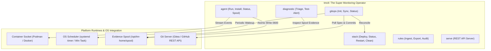

# TN-025 — Elevate tmctl to Super Operator with Integrated Agent, Pure Pull-Based GitOps, and Embedded REST API Daemon

| Field | Value |
| --- | --- |
| Status | Completed |
| Activity Type | Tooling Consolidation, GitOps Automation & Observability Architecture Refactoring |
| Record Type | Live |
| Project | Tomcat Monitoring |
| Phase | Continuous Integration and Deployment |
| Activity Date | 2026-09-26 |
| Recorded Date | 2026-09-26 |
| Owner | Eddy Wiyatno |
| Working Mode | Write |
| Authorization Status | Approved |
| Approved By | Eddy Wiyatno |
| Approval Date | 2026-09-26 |

---

## 🎯 Objective

Mengkonsolidasikan arsitektur ekosistem *Tomcat Monitoring* yang sebelumnya terfragmentasi di 5 repositori terpisah (`tomcat-monitoring`, `tomcat-diagnostic-event-collector`, `tm-agent`, `tomcat-diagnostic-service`, `tmctl`) menjadi **satu biner *Super Operator* terpadu (`tmctl`)** dengan filosofi rancangan dan kesetaraan fitur penuh (*1-to-1 parity*) terhadap `tcctl`.

Aktivitas rekayasa ini mencakup:
1. Menyerap fungsionalitas daemon pengumpul event kontainer (`tm-agent`) langsung ke dalam `tmctl agent` dan mengarsipkan skrip Bash warisan `collector.sh`.
2. Mengimplementasikan mesin *Pure Pull-Based GitOps* (`tmctl gitops`) yang otonom membaca manifest deklaratif `monitoring-spec.yaml` via REST API Gitea/GitHub (tanpa ketergantungan Git CLI pada Windows) dan dikendalikan oleh penjadwal native OS (*systemd user timer* pada Linux dan *Windows Task Scheduler* pada Windows Server).
3. Mengembangkan mesin evaluasi crash deterministik (`tmctl diagnostic triage`) untuk mendeteksi *Cgroup OOM Killer* (exit code 137) dan *JVM Abort* (exit code 134), serta pengujian alert end-to-end (`tmctl diagnostic test-alert`).
4. Menyediakan daemon REST API ringan (`tmctl serve`) berotentikasi token untuk integrasi *Self-Service Portal*.
5. Melakukan verifikasi multi-OS melalui unit test suite Go, validasi kontrak platform, dan kompilasi biner statis (`bin/tmctl` ELF Linux dan `bin/tmctl.exe` PE Windows).

Aktivitas ini mengeksekusi keputusan arsitektur [TM-ADR-0032](../adr/TM-ADR-0032.md).

---

## 🌍 Background & Problem Statement

Seiring bertumbuhnya kapabilitas platform Tomcat Monitoring, terjadi fragmentasi repositori dan dependensi operasional:

```text
                  SEBELUM: FRAGMENTASI 5 REPOSITORI
┌────────────────────────────────────────────────────────────────────────┐
│ 1. tomcat-monitoring                  ──► Ansible Orchestrator (Push)  │
│ 2. tomcat-diagnostic-event-collector  ──► Bash Daemon (Fragile)        │
│ 3. tm-agent                           ──► Go Daemon (Redundant Engine) │
│ 4. tomcat-diagnostic-service          ──► Node.js Core AI Engine       │
│ 5. tmctl                              ──► Partial Go CLI Operator      │
└────────────────────────────────────────────────────────────────────────┘
```

### Masalah Utama:
1. **Redundansi Kode & Beban Pemeliharaan:** `tomcat-diagnostic-event-collector` (Bash) dan `tm-agent` (Go) mengerjakan tugas yang sama (spooling event socket). `tm-agent` menduplikasi modul `internal/engine` yang sudah ada di `tmctl`.
2. **Ketergantungan Push-Based Ansible:** Menggunakan kontroler Ansible eksternal untuk mengelola pemantauan harian membutuhkan pembukaan port SSH/WinRM, penanganan SSH key, dan rentan gagal jika koneksi terputus di tengah jalan.
3. **Kontras dengan Paradigma `tcctl`:** `tcctl` beroperasi mandiri sebagai *Super Operator* untuk beban kerja Tomcat. Sementara itu, operator monitoring masih dipaksa berpindah-pindah antara Ansible, skrip Bash, dan beberapa CLI terpisah.

---

## 🏗️ Architecture & Implementation Details

Konsolidasi dilakukan pada branch **`lab`** repositori `tmctl` dengan membagi kapabilitas ke dalam 4 modul internal baru:



### 1. Paket `internal/agent`: Penyerapan Telemetry Daemon
* **`collector.go`**: Berlangganan streaming socket event kontainer engine (`died`, `oom`, `restart`), memfilter target kontainer (`tomcat-jmx-exporter`), dan mencatat snapshot bukti crash.
* **`writer.go` & `retention.go`**: Menulis rekaman `event-record-v1` secara atomik (`.tmp` $\rightarrow$ `.json`) dengan izin ketat `0600` (`-rw-------`), batasan muatan payload 16 KiB, pemangkasan kadaluarsa 24 jam, pembersihan orphan `.tmp` 60 menit, dan kuota FIFO 1.000 berkas.
* **`mgmt.go`**: Memasang daemon secara otomatis ke `systemd --user` pada Linux atau *Windows Service* (`TomcatMonitoringAgent`) pada Windows Server.

### 2. Paket `internal/gitops`: Pure Pull-Based Reconciliation Engine
* **`client.go`**: Menghubungi REST API Gitea/GitHub (`/api/v1/repos/<owner>/<repo>/commits` dan raw endpoint) untuk membaca commit SHA dan berkas `monitoring-spec.yaml` secara murni via HTTP (bebas dependensi biner Git eksternal di Windows).
* **`systemd.go`**: Mengonfigurasi timer native OS (`systemd --user timer` pada Linux atau *Windows Task Scheduler* `tmctl-gitops-reconciler` pada Windows Server) dengan interval terparameterisasi (default: 5 menit).
* **`sync.go`**: Membaca manifest deklaratif `monitoring-spec.yaml`, mendeteksi *drift* terhadap kontainer aktif di host, melakukan rekonsiliasi otomatis melalui `orchestrator.Deployer`, memastikan agen telemetry hidup, serta meng-ingest aturan AI diagnostik secara *hot-reload*.
* **`state.go` & `status.go`**: Menyimpan dan menampilkan riwayat rekonsiliasi pada `state.json` (commit aktif, status sinkronisasi, daftar service aktif, error drift).

### 3. Paket `internal/diagnostic`: Crash Triage & Alert Verification Probe
* **`triage.go`**: Mengevaluasi kode keluar (*exit code*) dan indikator OOM kontainer secara deterministik:
  * Exit code 137 / `OOMKilled=true` $\rightarrow$ Diagnosa: *Cgroup Memory Exhaustion*, rekomendasikan alokasi heap JVM dan batas memori kontainer.
  * Exit code 134 $\rightarrow$ Diagnosa: *JVM Fatal Abort (SIGABRT)*, rekomendasikan inspeksi `hs_err_pid.log`.
  * Exit code 143 $\rightarrow$ Diagnosa: *SIGTERM Shutdown / Rolling Update*.
* **`alert.go`**: Mengirim *synthetic alert* berformat Alertmanager API v2 (`/api/v2/alerts`) untuk memverifikasi jalur pengiriman notifikasi hingga ke SMTP relay Postfix/Mailpit.

### 4. Paket `internal/api`: Embedded REST API Daemon
* **`server.go` & `middleware.go`**: Server HTTP mandiri berbasis standard library Go dengan middleware otentikasi API Key (`X-API-Key` / Bearer token), CORS, dan logging akses.
* Menyediakan endpoint: `GET /healthz`, `GET /api/v1/stack/status`, `GET /api/v1/agent/status`, `POST /api/v1/gitops/sync`, `GET /api/v1/gitops/status`, dan `POST /api/v1/diagnostic/triage`.

---

## 🧪 Verification & Test Results

### 1. Eksekusi Unit Test Suite Go
Seluruh paket baru berhasil melewati unit test suite komprehensif:

```bash
go test -v ./...
```

```text
=== RUN   TestRecordValidationAndWriting
--- PASS: TestRecordValidationAndWriting (0.00s)
=== RUN   TestRetentionQuotaEnforcement
--- PASS: TestRetentionQuotaEnforcement (0.01s)
PASS: internal/agent (0.014s)

=== RUN   TestHealthzEndpoint
--- PASS: TestHealthzEndpoint (0.00s)
=== RUN   TestAuthMiddleware
--- PASS: TestAuthMiddleware (0.08s)
PASS: internal/api (0.037s)

=== RUN   TestExecuteTriageWithOOMRecord
--- PASS: TestExecuteTriageWithOOMRecord (0.00s)
PASS: internal/diagnostic (0.004s)

=== RUN   TestParseGitURL
--- PASS: TestParseGitURL (0.00s)
=== RUN   TestMonitoringSpecValidation
--- PASS: TestMonitoringSpecValidation (0.00s)
=== RUN   TestGitOpsStatePersistence
--- PASS: TestGitOpsStatePersistence (0.00s)
PASS: internal/gitops (0.003s)

PASS: internal/orchestrator, internal/config, internal/registry, internal/validator
```

### 2. Platform Contract & Sensitive Leak Audit
```bash
./bin/tmctl validate
```
```text
ℹ INFO: Starting baseline validation on project root: .
[1/3] Validating repository layout and required contract files...
[2/3] Auditing repository for forbidden sensitive material files...
[3/3] Validating JSON schema syntax integrity across configuration files...
✔ SUCCESS: All platform validation assertions passed successfully.
```

### 3. Kompilasi Biner Multi-OS
```bash
make build-all
```
* **Linux ELF (amd64):** `bin/tmctl` (**6.9 MB**, static, `CGO_ENABLED=0`)
* **Windows PE (amd64):** `bin/tmctl.exe` (**7.2 MB**, static, `CGO_ENABLED=0`)

---

## 📈 Impact & Transition Path

| Parameter | Sebelum (As-Is) | Sesudah (To-Be) |
| :--- | :--- | :--- |
| **Biner yang Didistribusikan** | `tmctl` + `tm-agent` + `collector.sh` | **1 Biner:** `tmctl` (Linux & Windows) |
| **Mekanisme Orkestrasi** | Ansible Controller (Push via SSH/WinRM) | **Pure Pull-Based GitOps** via OS Timer |
| **Ketergantungan Eksternal** | Python, Ansible, Bash, SSH keys | **Zero Dependency** (Pure Go Binary) |
| **Self-Healing Runtime** | Tidak ada (butuh eksekusi playbook ulang) | **Otomatis** via `tmctl gitops sync` |
| **Paritas dengan `tcctl`** | Berbeda dan terpecah | **1-to-1 Parity** (Konsisten & Seragam) |
